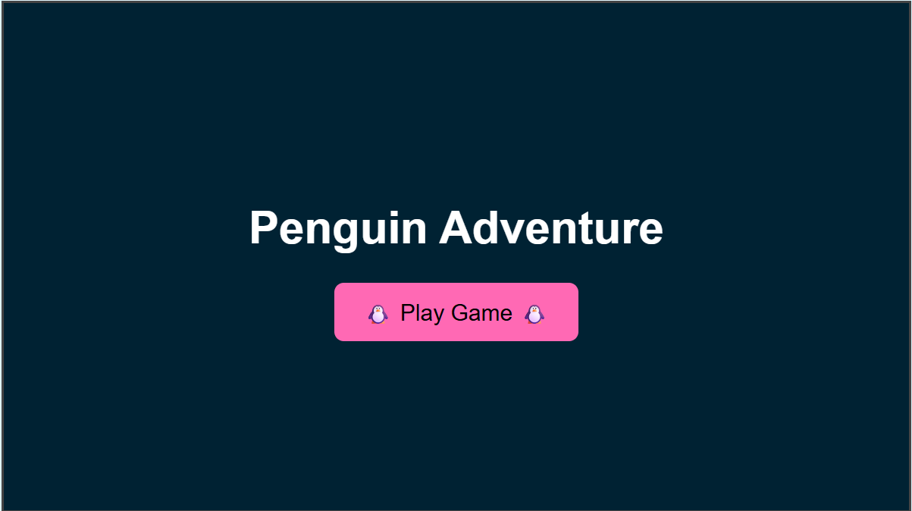
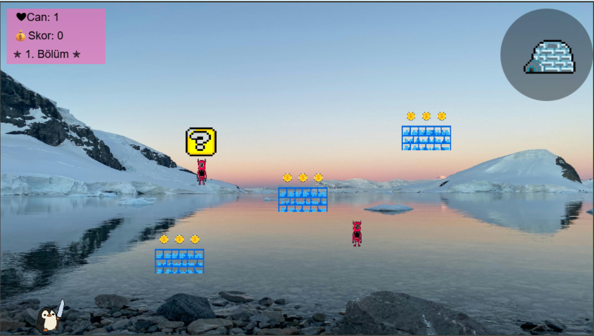
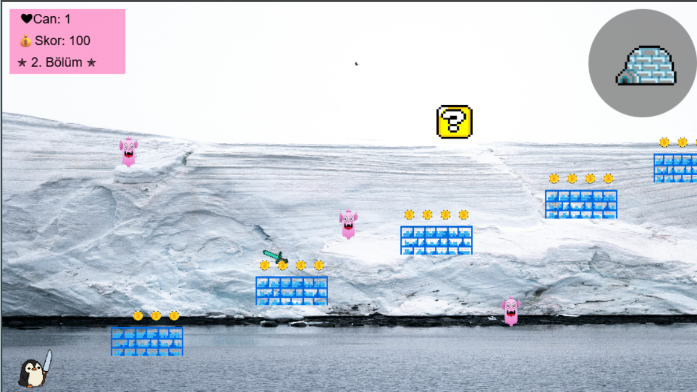
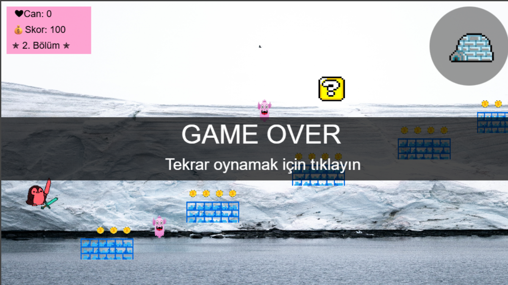
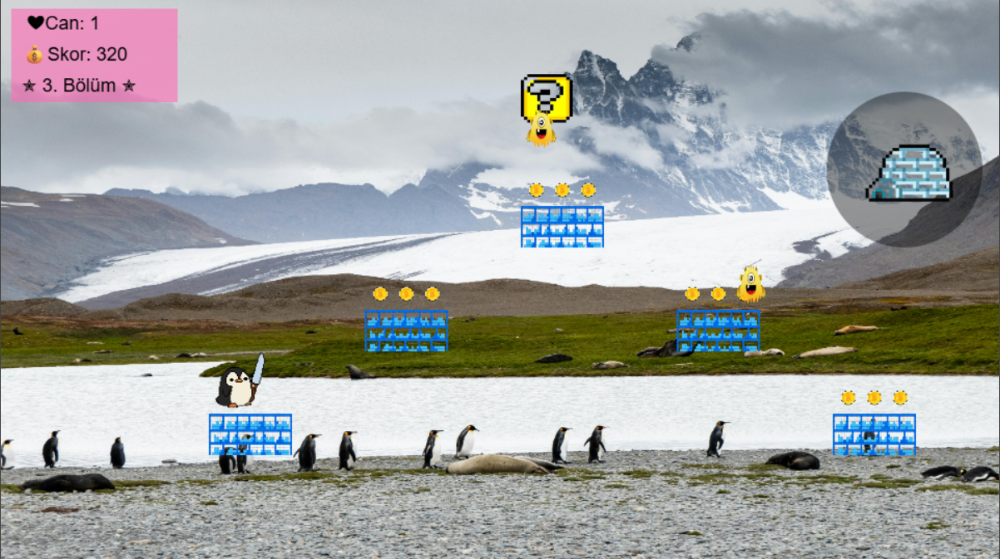
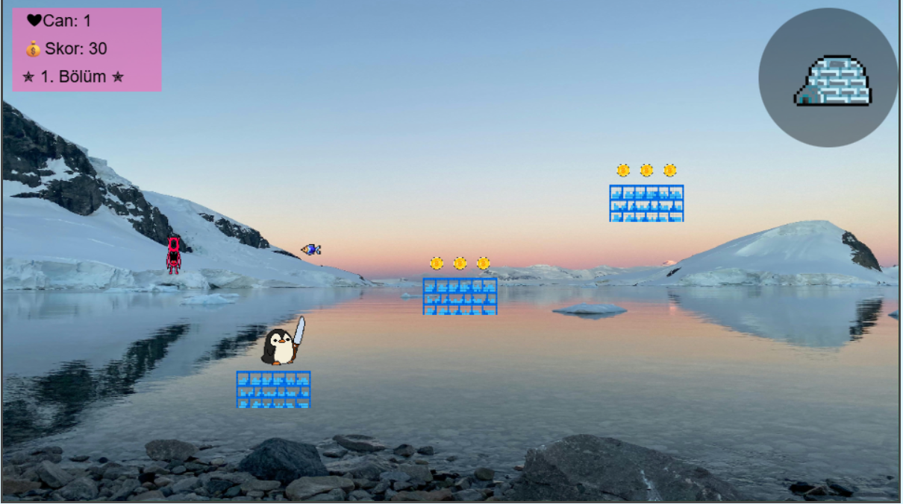
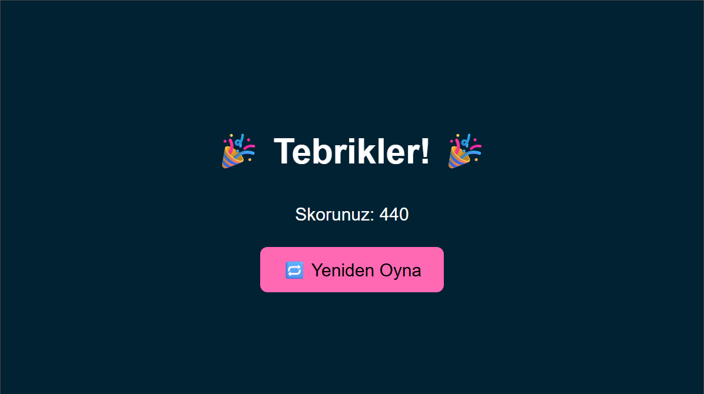

# 🎮 Web Tabanlı 2D Platform Oyunu – Penguin Adventure

Bu proje, Web Tabanlı Programlama dersi kapsamında geliştirilmiş bir 2D platform oyunudur. Oyuncu, kutuplarda geçen bu macerada bir **penguen** karakterini kontrol eder. Amacınız: canavarlarla savaşarak balıkları toplamak, canınızı korumak ve bölümleri geçmek!

---

## 🔗 Canlı Oyun Linki

👉 [Oyunu Buradan Oynayın](https://rumeysaersoyy.github.io/webprojesi)

---

## 📁 Proje Yapısı
webprojesi/  
├── index.html → Ana HTML dosyası  
├── game.js → Oyun motoru ve mantığı  
├── resimler/ → Tüm görseller (penguen, canavarlar, zemin vs.)  
├── sesler/ → Oyun içi ses efektleri  

---

## 🕹️ Oyun Özellikleri

- 🎮 Yön tuşları ile karakter hareketi
- 🗡️ F tuşu ile kılıç fırlatma
- 🧊 Engeller, kutular ve canavarlar
- 🐟 Balık toplayarak can kazanma
- 💀 Can azalınca "Game Over" ekranı
- 🔊 Arka plan müziği ve ses efektleri

---

## 🎨 Kullanılan Assetler (Kaynaklar)

Tüm assetler telif hakkı içermeyen veya ücretsiz kullanıma açık platformlardan alınmıştır:

- Penguen karakteri: [OpenGameArt.org](https://opengameart.org/)
- Canavarlar: [OpenGameArt.org](https://opengameart.org/)
- Arka plan görselleri: [Pixabay](https://pixabay.com/)
- Oyun sesleri: [Freesound.org](https://freesound.org/)
- Soru işareti bloğu ve coin: [Kenney.nl](https://kenney.nl/assets)
---

## 🎥 Oyun Tanıtım Videosu

Oyun oynanışını anlatan en az 1 dakikalık video yakında YouTube kanalımıza yüklenecektir. Video linki eklendiğinde burada paylaşılacaktır.

---

## 🎮 Oyun İçi Görseller

 

## İlham aldığım oyunun ismi ve kaynağı
Oyun İsmi:
That Time I Got Reincarnated as a Panda and had to Collect Coins by Rolling Away on Built-to-Scale Platforms

Orijinal Oyun Bağlantısı:
https://colisan.itch.io/that-time-i-got-reincarnated-as-a-panda-a-h-t-c-c-b-r-a-o-b-t-s-p

## 📌 Lisans

Bu proje eğitim amaçlı olarak geliştirilmiştir. Kâr amacı güdülmeden yayınlanmakta olup tüm kaynaklar uygun lisanslarla alınmıştır.

---
## 👩‍💻 Geliştirici

Rumeysa Ersoy  
Bilgisayar Mühendisliği Öğrencisi  
GitHub: [@rumeysaersoyy](https://github.com/rumeysaersoyy)
